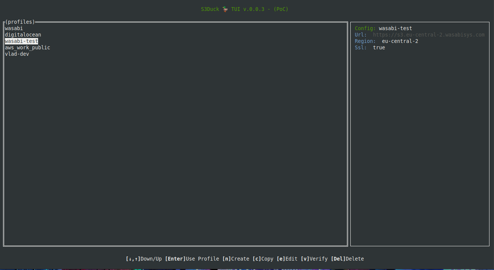
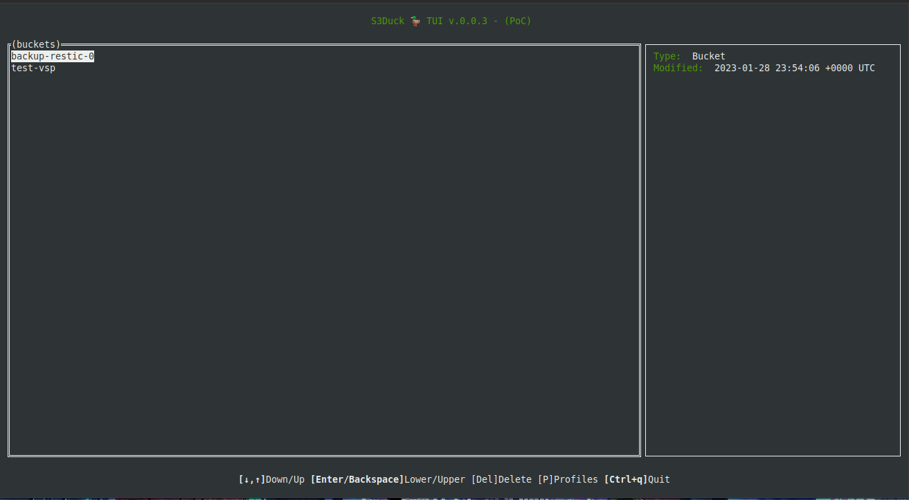
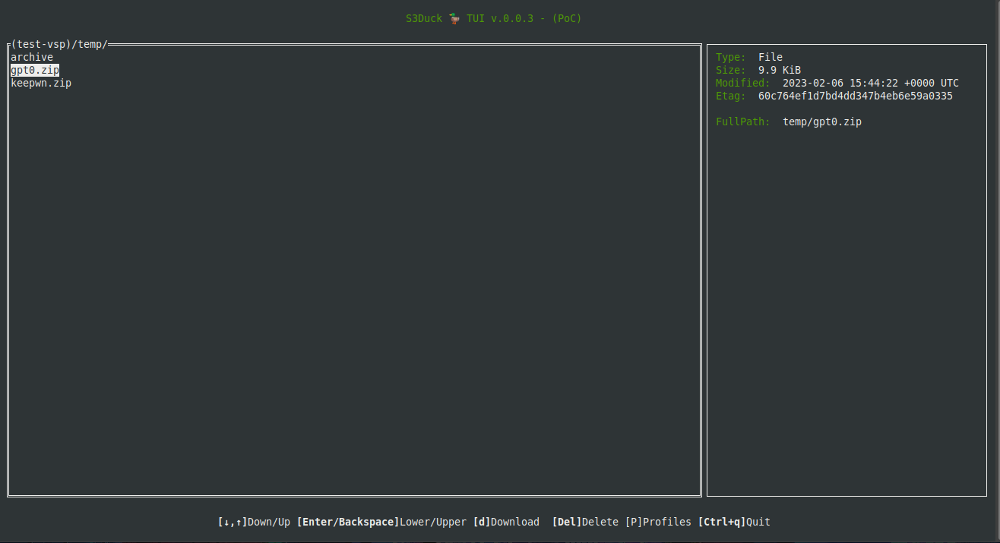

S3Duck-TUI 🦆
======

TUI implementation of [S3Duck](https://github.com/nexusriot/s3duck)

Features
-------------

1. Profiles support
2. Walking buckets
3. Downloading support
4. Buckets/Objects deleting support
------------- 







Building
------------- 
```
go build
```
build statically without dependency on libc:
```
go build -ldflags "-linkmode external -extldflags -static"
```

Building deb package
------------- 
Install required packages:
```
sudo apt-get install git devscripts build-essential lintian upx-ucl
```
Run build:
```
./build-deb.sh
```
