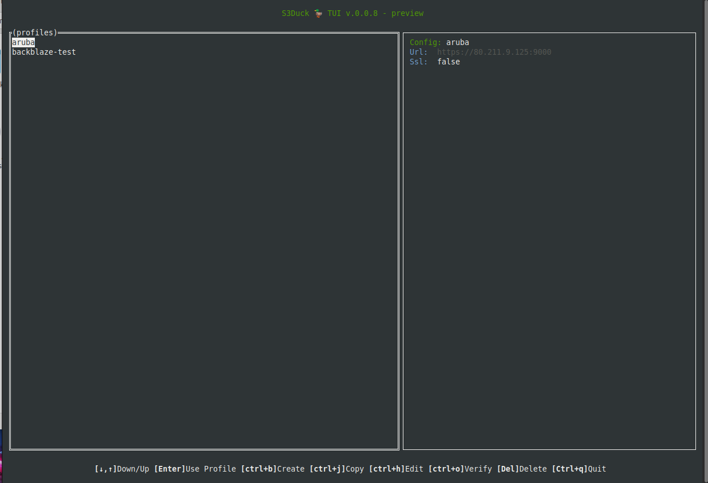
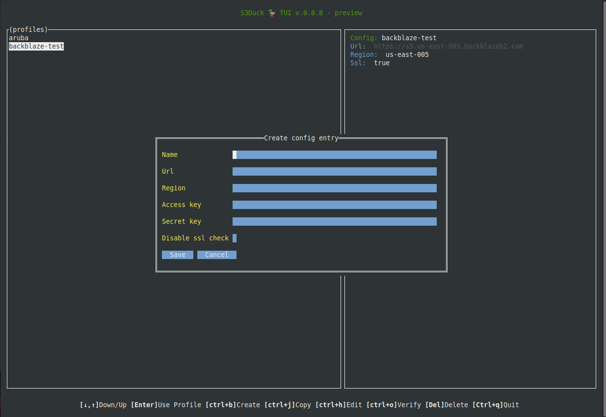
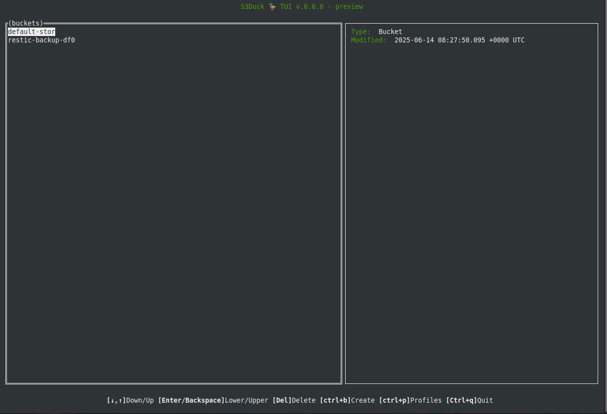
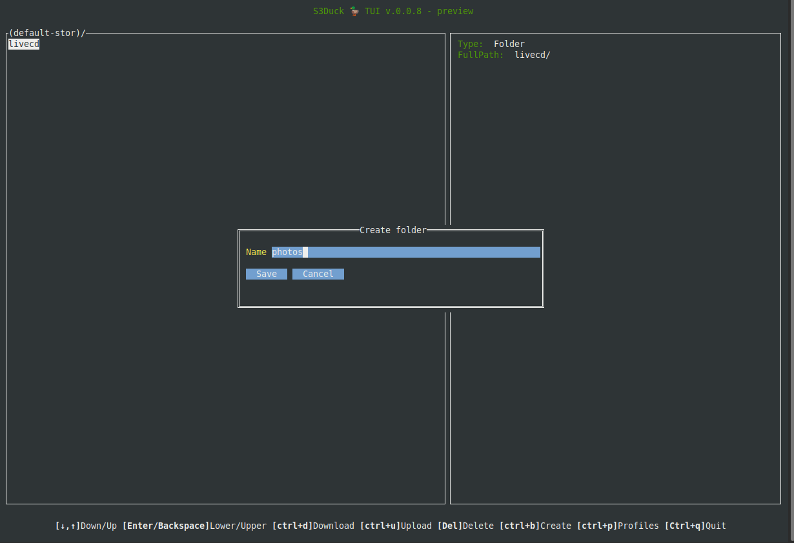
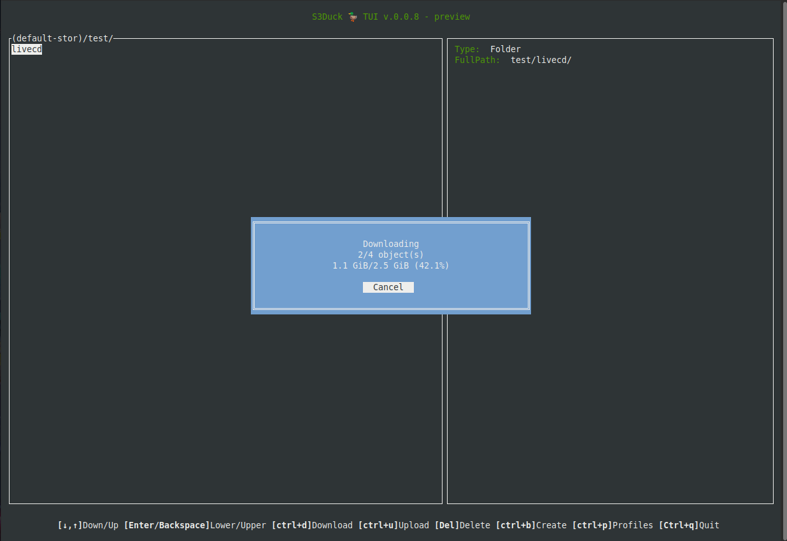
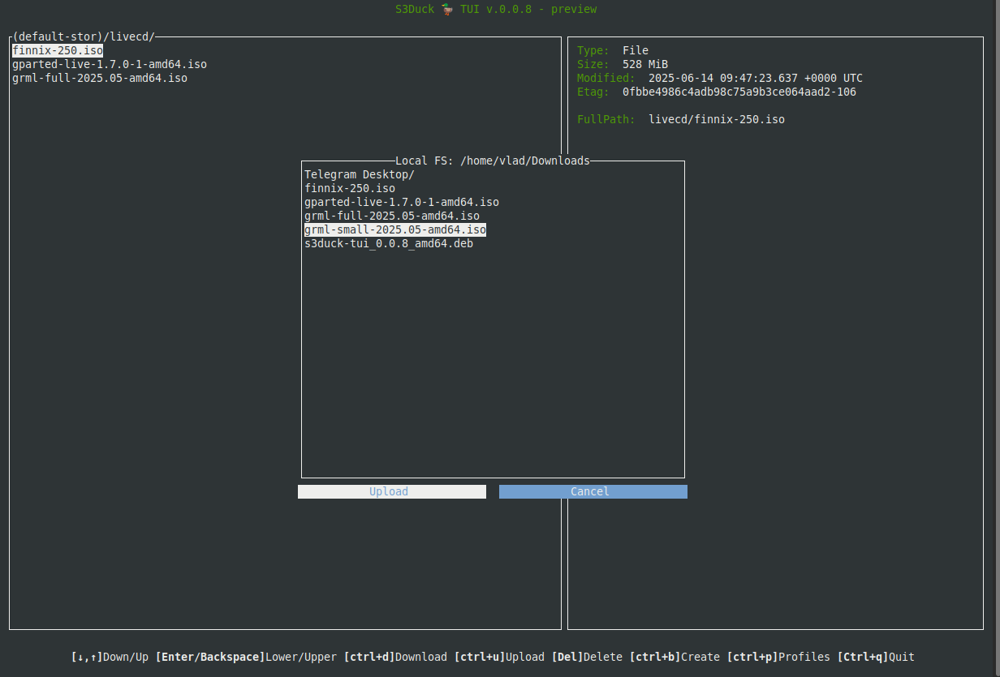
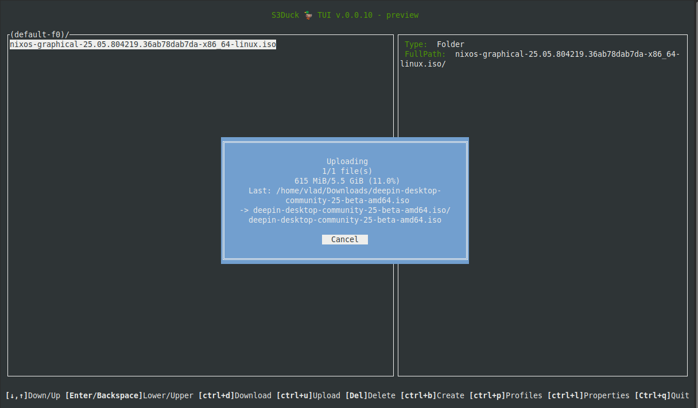

S3Duck-TUI 🦆
======

Terminal UI client for S3-compatible object storage. A TUI implementation of [S3Duck](https://github.com/nexusriot/s3duck) built in Go on top of [tview](https://github.com/rivo/tview) / [tcell](https://github.com/gdamore/tcell), using the AWS SDK for Go v2.

Works with AWS S3 and any S3-compatible service (MinIO, Ceph RGW, Yandex/VK Cloud, Backblaze B2, etc.) by pointing at a custom endpoint URL.

Features
-------------

1. Multi-profile support (create / edit / delete / clone / verify)
2. Bucket browsing with folder-style navigation (delimiter `/`)
3. Bucket creation (private or public-read) and deletion
4. Folder creation (zero-byte `prefix/` markers)
5. Recursive download of files and folders, with progress and overwrite prompts (Overwrite / Skip / Overwrite All / Skip All / Cancel)
6. Multi-select for batch download (Space, Ctrl+S all, Ctrl+X none)
7. Upload with built-in local filesystem browser; preserves directory tree, creates markers for empty folders
8. Bucket / folder size summary (Ctrl+G)
9. Object properties (size, ETag, storage class, last modified) in the side panel
10. Clipboard yank of profile data (Ctrl+Y)
11. Server-side copy / move / rename, recursive for folders, multi-select aware (Ctrl+Y copy, Ctrl+T move, Ctrl+R rename)
12. Custom endpoints and self-signed TLS support (`ignore_ssl`)
13. Linux, FreeBSD and macOS / Windows builds (statically linkable)

Screenshots
-------------









Architecture
-------------

The project follows a classic **Model–View–Controller** layout. The controller is the only component aware of both the AWS SDK layer and the tview UI; the model is pure storage I/O, and the view is pure UI primitives.

```
                +-----------------------------+
                |   cmd/s3duck-tui/main.go    |
                |  controller.NewController() |
                |          .Run()             |
                +--------------+--------------+
                               |
                               v
+------------------------------------------------------------+
|                    pkg/controller                          |
|  - app state: current bucket, path, selection, positions   |
|  - keybindings, modals, forms, progress UI                 |
|  - orchestrates Model calls from goroutines, marshals      |
|    UI updates back via App.QueueUpdateDraw                 |
+----------+----------------------------+--------------------+
           |                            |
           v                            v
+----------------------+    +----------------------------+
|   pkg/view           |    |   pkg/model                |
|  tview widgets:      |    |  AWS SDK v2 wrapper:       |
|   - List / Frame     |    |   - ListBuckets / List     |
|   - Details TextView |    |   - CreateBucket/Folder    |
|   - Modals & Forms   |    |   - Delete (paged 1000)    |
|   - Hotkeys / About  |    |   - Upload  (s3manager)    |
|   - Local FS browser |    |   - Download(s3manager)    |
+----------------------+    |   - GetBucketLocation      |
                            |   - PrepareUpload /        |
                            |     ResolveDownloadObjects |
                            |   - progressReader /       |
                            |     progressWriterAt       |
                            +-------------+--------------+
                                          |
                                          v
                              +-------------------------+
                              |    internal/config      |
                              |  ~/.config/s3duck-tui/  |
                              |       config.json       |
                              |  Params.NewConfiguration|
                              |  Copy / Delete / Write  |
                              +-------------------------+
                                          |
                                          v
                              +-------------------------+
                              |    pkg/utils            |
                              |  SplitFunc, RandStr,    |
                              |  CopyToClipboard        |
                              +-------------------------+
```

### Packages

| Path | Responsibility |
| --- | --- |
| `cmd/s3duck-tui/main.go` | Thin entrypoint: instantiates the controller and runs the tview app loop. |
| `pkg/controller` | Application state and event handling. Owns key bindings, modal flows (create/edit profile, create bucket/folder, download, upload, overwrite prompt, summary), selection scoping per `bucket:path`, and goroutine→UI marshalling. |
| `pkg/view` | Pure tview construction. Builds the main flex layout (object list + details panel), modal helper, profile form, local-file browser, hotkeys / about pop-ups. Contains the version string. |
| `pkg/model` | S3 layer. Wraps `s3.Client`, `s3manager.Downloader/Uploader`, custom endpoint resolver, static-credentials provider, and TLS skip-verify. Exposes high-level operations: `List`, `ListBuckets`, `ListObjects`, `Download` / `DownloadTarget`, `Upload`, `PrepareUpload`, `ResolveDownloadObjects`, `Delete`, `DeleteBucket`, `CreateBucket`, `CreateFolder`, `MakeBucketPublic`, `GetBucketLocation`, `RefreshClient`. Implements `progressReader` / `progressWriterAt` for live byte-count progress. |
| `pkg/utils` | Small helpers: path-split rune predicate, random string, clipboard write. |
| `internal/config` | JSON profile storage in `~/.config/s3duck-tui/config.json` — load, write, append, copy, delete; auto-creates the file/dir on first run with `0700` permissions. |

### Data flow

1. **Startup** — `main` builds a `Controller`, which builds a `View` and loads `Params` from `internal/config`. The profile list is rendered first.
2. **Open profile** — selecting a profile constructs a `model.Config` and calls `model.NewModel`, which builds the AWS config (custom endpoint resolver + static credentials + 30s HTTP client with optional `InsecureSkipVerify`).
3. **Browse** — selecting a bucket triggers `RefreshClient` (resolves bucket region via `GetBucketLocation`, rebuilds the client). Subsequent navigation uses `List(prefix, bucket)` with `Delimiter="/"` to render folders + files.
4. **Transfer** — long-running operations (download / upload / delete / summary) run in goroutines with a `context.Context` that the cancel button on the progress modal can cancel. Progress callbacks are funneled back to the UI through `App.QueueUpdateDraw`.
5. **Selection scope** — multi-select state is keyed by `bucket:path`, so selections survive navigation in and out of folders.

### Configuration

Profiles live in `~/.config/s3duck-tui/config.json` as a JSON array of:

```json
{
  "name":       "minio-local",
  "base_url":   "https://s3.example.com",
  "region":     "us-east-1",
  "access_key": "AKIA...",
  "secret_key": "...",
  "ignore_ssl": false
}
```

`region` is optional for non-AWS endpoints; for AWS it is auto-detected from `GetBucketLocation` on bucket entry.

Hotkeys
-------------

**Profiles screen**

| Key | Action |
| --- | --- |
| ↑ / ↓ | Navigate |
| Enter | Open profile |
| Ctrl+N | Create profile |
| Ctrl+E | Edit profile |
| Ctrl+Y | Copy / clone profile |
| Ctrl+V | Verify profile (test connection) |
| Del | Delete profile |
| Ctrl+H | Hotkeys help |
| Ctrl+A | About |
| Ctrl+Q | Quit |

**Browser screen**

| Key | Action |
| --- | --- |
| ↑ / ↓ | Navigate |
| Enter | Open folder / bucket |
| Backspace | Go up (`..`) |
| Ctrl+P | Back to profiles |
| Ctrl+N | Create bucket / folder |
| Ctrl+D | Download (current or selected) |
| Ctrl+U | Open local FS browser to upload |
| Ctrl+G | Bucket / folder size summary |
| Space | Toggle selection on item |
| Ctrl+S | Select all |
| Ctrl+X | Unselect all |
| Ctrl+L | Properties |
| Del | Delete (recursive for prefixes) |
| Ctrl+H | Hotkeys help |
| Ctrl+A | About |
| Ctrl+Q | Quit |

Building
-------------

```
go build ./cmd/s3duck-tui
```

Statically linked (no libc dependency):

```
go build -ldflags "-linkmode external -extldflags -static" ./cmd/s3duck-tui
```

Building a deb package
-------------

Install required tooling:

```
sudo apt-get install git devscripts build-essential lintian upx-ucl
```

Build (amd64 by default):

```
./build-deb.sh          # amd64
./build-deb-arm64.sh    # arm64
```

Building a FreeBSD binary
-------------

```
GOOS=freebsd GOARCH=amd64 go build ./cmd/s3duck-tui
```

License
-------------

See [LICENSE](LICENSE).
